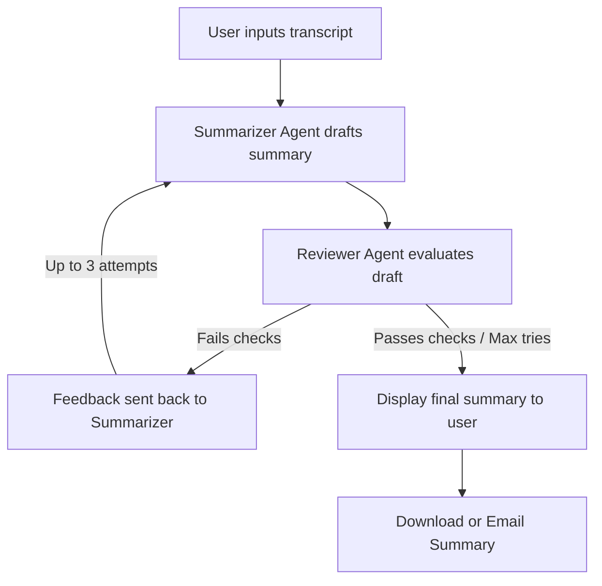

# Recaply 🤖📝
### AI-Powered Meeting Summarizer & Action Item Tracker

Recaply is an intelligent assistant that transforms messy, unstructured meeting transcripts into clean, structured summaries and actionable next steps—instantly. Whether you are a student coordinating group projects or a professional tracking team alignments, Recaply helps you skip manual note-taking and focus on execution.

---

## 🌟 Key Features

1. **Smart Summarization**: Automatically distills key discussion points and decisions.
2. **Action Item Tracking**: Extracts tasks, assignees, deadlines, and priorities from the transcript.
3. **Agentic Self-Correction Loop**: Uses an iterative AI review process to self-correct and verify summary quality before displaying it.
4. **Seamless Sharing**: Download the summary directly as a text file or email it to your team in one click.

---

## ⚙️ How It Works (The Agentic Loop)

Recaply is built on an **Agentic Feedback Loop** using the Groq API (`llama-3.3-70b-versatile` model):



*   **Step 1**: The *Summarizer Agent* generates an initial summary and structured action items.
*   **Step 2**: The *Reviewer Agent* inspects the summary against key criteria (Is it clean plain text? Are there assignees, deadlines, and priorities for action items? Does it contain both a summary and action list?).
*   **Step 3**: If the review **passes**, the summary is shown. If it **fails**, the feedback is piped back into the summarizer to regenerate a higher-quality draft (up to 3 times).

---

## 🛠️ Technology Stack

*   **Frontend**: Streamlit (Python web framework)
*   **AI Engine**: Groq API (`llama-3.3-70b-versatile`)
*   **Email Sharing**: Python's `smtplib` connected via Gmail SMTP (SSL-secured)

---

## 🚀 Quick Setup Guide

### 1. Prerequisites
Make sure you have:
*   Python 3.10+ installed on your computer.
*   A Groq API Key (get it from the [Groq Console](https://console.groq.com/)).
*   A Gmail account with an **App Password** configured (required to send automated emails).

### 2. Installation
Clone or navigate to the directory and install dependencies:
```bash
# Activate your virtual environment (if using one)
.venv\Scripts\activate

# Install required libraries
pip install -r requirements.txt
```

### 3. Environment Configuration
Create/edit the `.env` file in the project folder and configure the following variables:
```env
# Your Groq API Key
GROQ_API_KEY=gsk_your_groq_key_here

# Gmail credentials for sending summaries
SENDER_EMAIL=your_gmail_username@gmail.com
SENDER_PASSWORD=your_16_character_app_password
```
*(Note: Do not use your regular Gmail password for `SENDER_PASSWORD`. Generate a 16-character **App Password** in your Google Account Security settings under 2-Step Verification).*

### 4. Run the Application
Start the Streamlit application by running:
```bash
streamlit run app.py
```
Open the local URL displayed in your terminal (usually `http://localhost:8501`) to start using Recaply!
